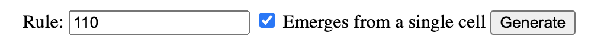
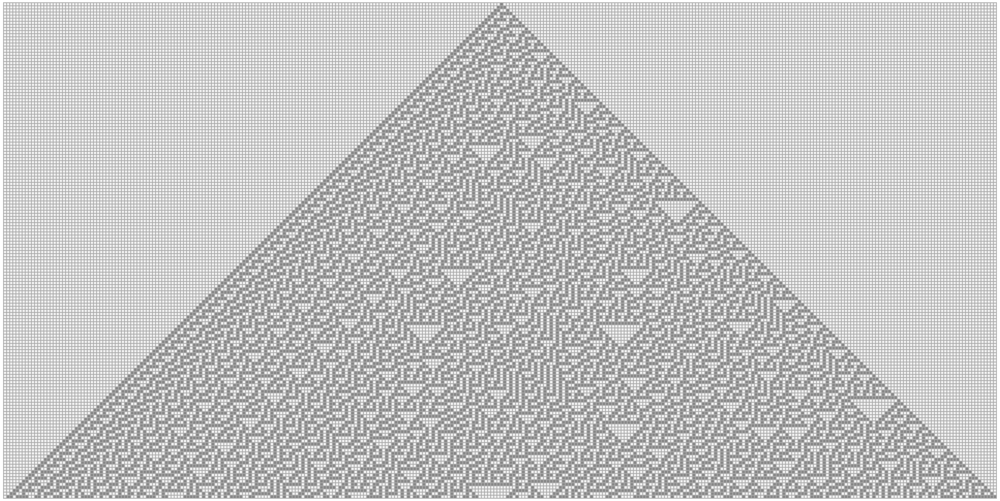
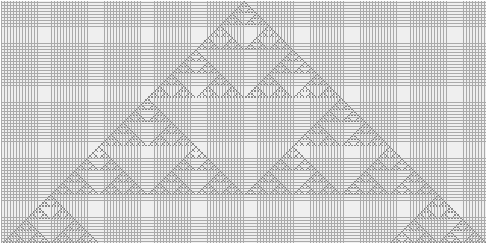
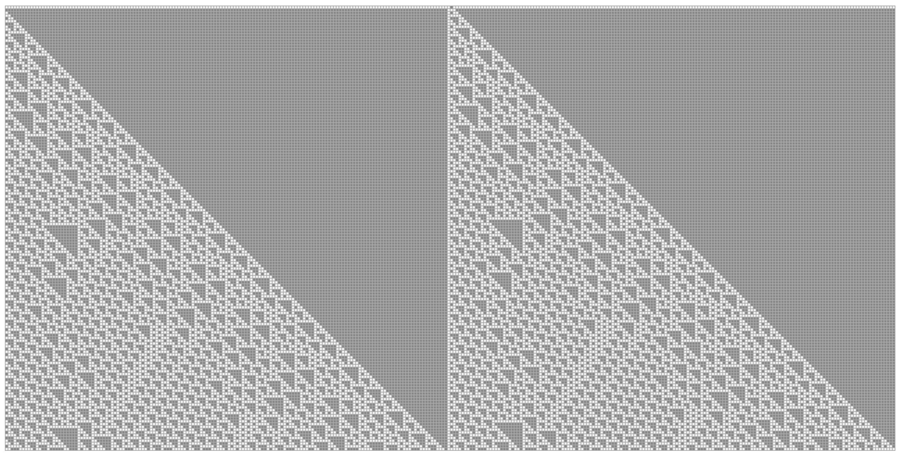

# Elementary cellular automaton
> [...] an elementary cellular automaton is a one-dimensional cellular automaton 
where there are two possible states (labeled 0 and 1) and the rule to determine 
the state of a cell in the next generation depends only on the current state of 
the cell and its two immediate neighbors. [1]

## Rules
A _Wolfram code_ is naming convention declared by Stephen Wolfram [3, 4] for elementary 
cellular automaton rules. Given that each cell has 3 neighbours / ancestors, which can be in 
two states `0` or `1`. Therefore, total number of combination is 23 possible 
_ancestor_ patterns. For each pattern we define a result, e.g. for pattern `110` the new cell 
state is `0`. 

| Pattern       | 111    | 110    | 101    | 100    | 011    | 010    | 001    | 000    |
| :---          | :----: | :----: | :----: | :----: | :----: | :----: | :----: | :----: |
| **New state** | 0      | 0      | 0      | 1      | 1      | 1      | 1      | 0      |

The name of a rule is the number in binary given by new state for center cell, 
e.g. 000111102 = 30.

### Rule 30 [[Live demo](https://matejker.github.io/elementary-cellular-automaton/orthogonal.html?rule=30)]

| Pattern       | 111    | 110    | 101    | 100    | 011    | 010    | 001    | 000    |
| :---          | :----: | :----: | :----: | :----: | :----: | :----: | :----: | :----: |
| **New state** | 0      | 0      | 0      | 1      | 1      | 1      | 1      | 0      |

### Rule 90 [[Live demo](https://matejker.github.io/elementary-cellular-automaton/orthogonal.html?rule=90)]

| Pattern       | 111    | 110    | 101    | 100    | 011    | 010    | 001    | 000    |
| :---          | :----: | :----: | :----: | :----: | :----: | :----: | :----: | :----: |
| **New state** | 0      | 1      | 0      | 1      | 1      | 0      | 1      | 0      |

### Rule 193 [[Live demo](https://matejker.github.io/elementary-cellular-automaton/orthogonal.html?rule=193)]

| Pattern       | 111    | 110    | 101    | 100    | 011    | 010    | 001    | 000    |
| :---          | :----: | :----: | :----: | :----: | :----: | :----: | :----: | :----: |
| **New state** | 1      | 1      | 0      | 0      | 0      | 0      | 0      | 1      |

## References
[1] Wikimedia (?), _Elementary cellular automaton_, https://en.wikipedia.org/wiki/Elementary_cellular_automaton  
[2] Wolfram Research (?), _Wolfram Atlas: Elementary Cellular Automata_, http://atlas.wolfram.com/01/01/  
[3] Stephen Wolfram (2002), _A New Kind of Science_, End of Line Clearance Book ISBN-10: 1579550258  
[4] Stephen Wolfram (1983), _Statistical mechanics of cellular automata_, Reviews of Modern Physics, Volume 55, Issue 3, July 1983, pp.601-644
