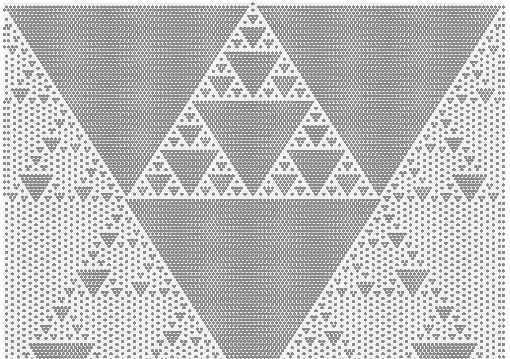

# Elementary cellular automaton in Hexagonal, Pentagonal and Other Tessellations
> [...] an elementary cellular automaton is a one-dimensional cellular automaton 
where there are two possible states (labeled 0 and 1) and the rule to determine 
the state of a cell in the next generation depends only on the current state of 
the cell and its two immediate neighbors. [1]

This is an easy tool for generating any of 256 _one-dimensional cellular automaton_ on various 
tiling such as squares, hexagons, pentagons...

## Squares
A _Wolfram code_ is naming convention declared by Stephen Wolfram [3, 4] for elementary 
cellular automaton rules. Given that each cell has 3 neighbours / ancestors, which can be in 
two states `0` or `1`. Therefore, total number of combination is 2<sup>3</sup> possible 
_ancestor_ patterns. For each pattern we define a result, e.g. for pattern `110` the new cell 
state is `0`. 

| Pattern       | 111    | 110    | 101    | 100    | 011    | 010    | 001    | 000    |
| :---          | :----: | :----: | :----: | :----: | :----: | :----: | :----: | :----: |
| **New state** | 0      | 0      | 0      | 1      | 1      | 1      | 1      | 0      |


The name of a rule is the number in binary given by new state for center cell, 
e.g. 00011110<sub>2</sub> = 30. See the live demo for 
[Rule 30](https://matejker.github.io/elementary-cellular-automaton/orthogonal.html?rule=30) and other 
[rules](./orthogonal.md) on _regular_ square grids.

## Hexagons
Second step for more complex tilings, but simpler cellular automaton are _hexagons_. 
Each hexagon has 2 neighbours / ancestors, therefore, there are just 2<sup>2</sup> possible 
_ancestor_ patterns.



| Pattern       | 11     | 10     | 01     | 00     |
| :---          | :----: | :----: | :----: | :----: | 
| **New state** | 1      | 0      | 0      | 1      |

Similar as in _squares_ the name comes from the binary number given the new states, 1001<sub>2</sub> = 9,
see [Rule 9](https://matejker.github.io/elementary-cellular-automaton/hexagonal.html?rule=9)

## Usage
Feel more that free to use, modify and copy the code, just follow the [licence](./LICENSE.txt) and cite it:

```tex
@misc{Kerekrety2020,
  author = {Kerekrety, M},
  title = {Elementary cellular automaton in Hexagonal, Pentagonal and Other Tessellations},
  year = {2020},
  publisher = {GitHub},
  journal = {GitHub repository},
  howpublished = {\url{https://github.com/matejker/elementary-cellular-automaton}}
}
```

## References
[1] Wikimedia (?), _Elementary cellular automaton_, https://en.wikipedia.org/wiki/Elementary_cellular_automaton  
[2] Wolfram Research (?), _Wolfram Atlas: Elementary Cellular Automata_, http://atlas.wolfram.com/01/01/  
[3] Stephen Wolfram (2002), _A New Kind of Science_, End of Line Clearance Book ISBN-10: 1579550258  
[4] Stephen Wolfram (1983), _Statistical mechanics of cellular automata_, Reviews of Modern Physics, Volume 55, Issue 3, July 1983, pp.601-644
