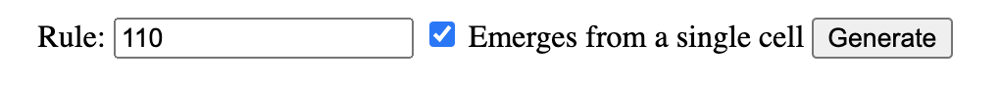
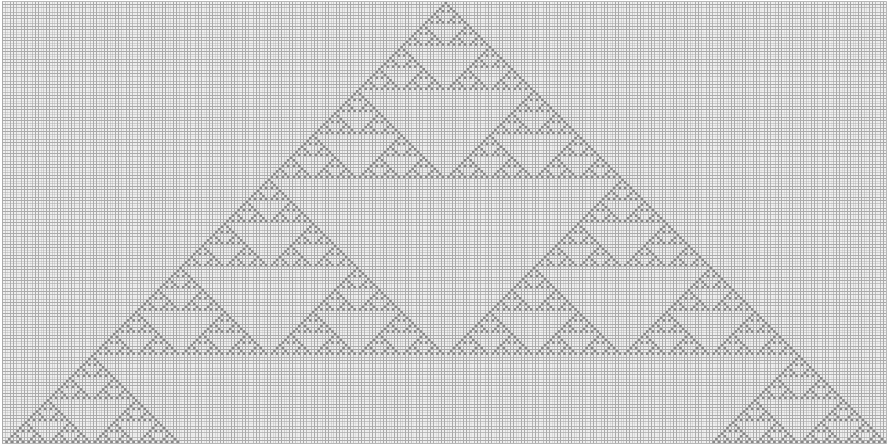
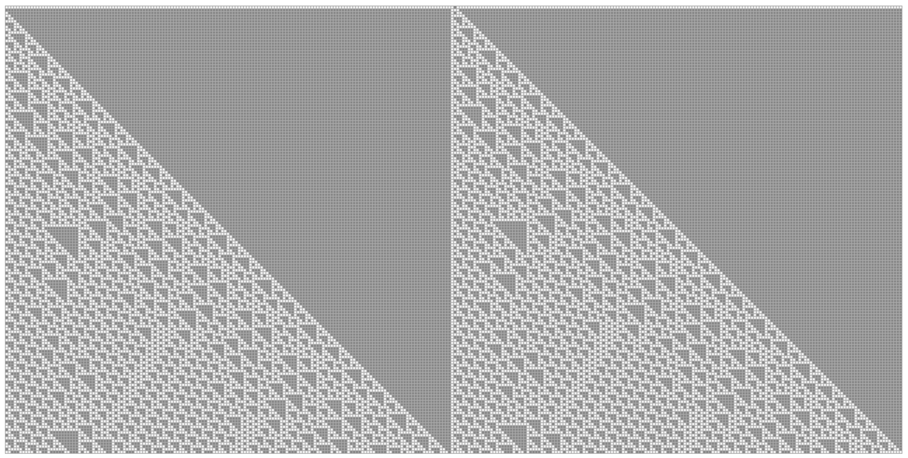

# Regular square grid

Enter the rule code (from `0` to `255`), then you can set  either initial 
condition as a single _living_ cell or a row with randomly selected `0` and `1`.

[The elementary cellular automaton generator](https://matejker.github.io/elementary-cellular-automaton/orthogonal.html)

## Rule 30 [[Live demo](https://matejker.github.io/elementary-cellular-automaton/orthogonal.html?rule=30)]

| Pattern       | 111    | 110    | 101    | 100    | 011    | 010    | 001    | 000    |
| :---          | :----: | :----: | :----: | :----: | :----: | :----: | :----: | :----: |
| **New state** | 0      | 0      | 0      | 1      | 1      | 1      | 1      | 0      |

## Rule 90 [[Live demo](https://matejker.github.io/elementary-cellular-automaton/orthogonal.html?rule=90)]

| Pattern       | 111    | 110    | 101    | 100    | 011    | 010    | 001    | 000    |
| :---          | :----: | :----: | :----: | :----: | :----: | :----: | :----: | :----: |
| **New state** | 0      | 1      | 0      | 1      | 1      | 0      | 1      | 0      |

## Rule 193 [[Live demo](https://matejker.github.io/elementary-cellular-automaton/orthogonal.html?rule=193)]

| Pattern       | 111    | 110    | 101    | 100    | 011    | 010    | 001    | 000    |
| :---          | :----: | :----: | :----: | :----: | :----: | :----: | :----: | :----: |
| **New state** | 1      | 1      | 0      | 0      | 0      | 0      | 0      | 1      |